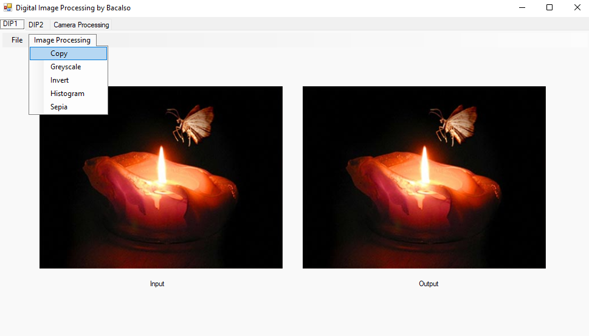
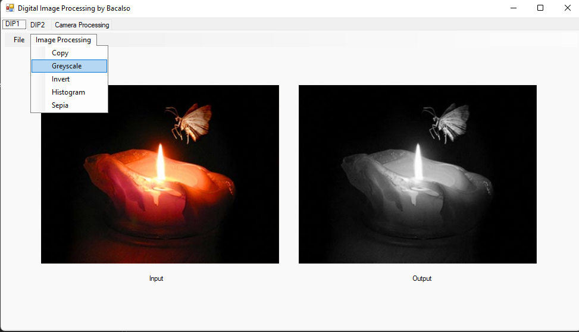
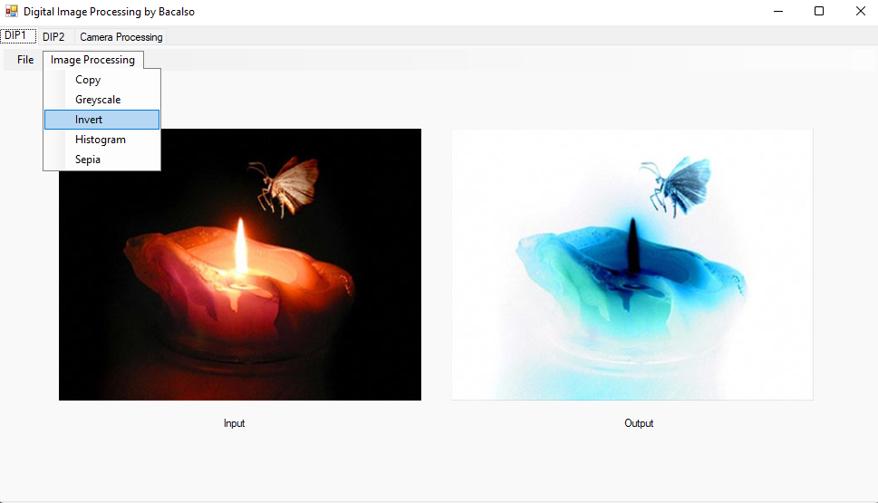
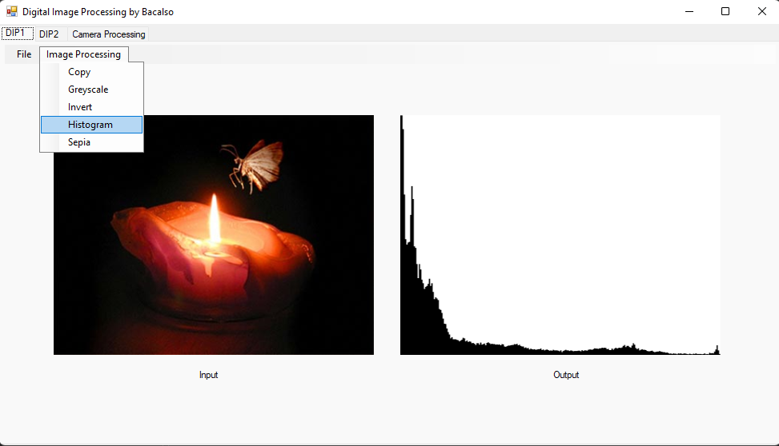
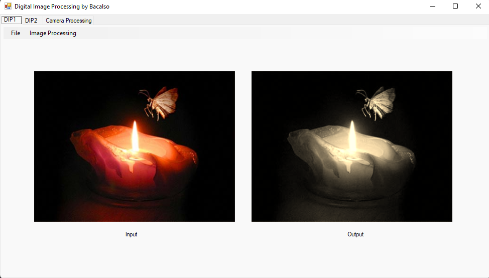
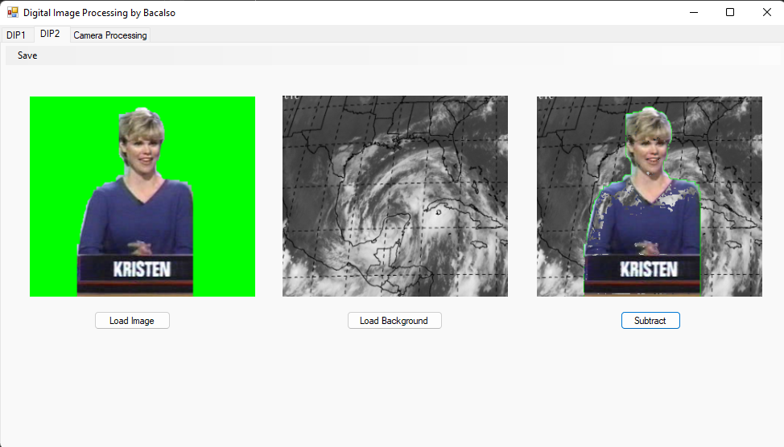

# Digital Image Processing
### by Sly Kint A. Bacalso

Features:

`Copy` - Basic copy image function

`Greyscale` - Convert image to greyscale

`Invert` - Invert image

`Histogram` - Display image histogram

`Sepia` - Convert image to sepia

`Subtract`` - Subtract image from another image
